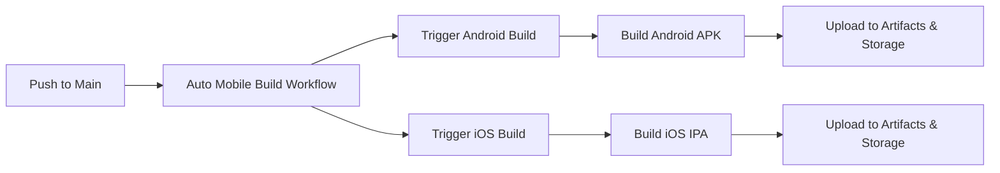

# Automated Mobile Build Setup

This guide explains how to set up automated mobile app builds (Android & iOS) that trigger when code is pushed to the main branch.

## Overview

The automated build system consists of:

1. **Auto-trigger workflow** (`.github/workflows/auto-mobile-build.yml`) - Triggers on push to main
2. **Android build workflow** (`.github/workflows/screens-android-mobile-build.yml`) - Builds Android APK
3. **iOS build workflow** (`.github/workflows/screens-ios-build.yml`) - Builds iOS IPA
4. **Edge function** (`supabase/functions/trigger-app-build`) - Manages build records (for manual triggers)

## How It Works



## Required Secrets

For the automated builds to work, you need to configure these GitHub secrets:

### Supabase Secrets
- `VITE_SUPABASE_URL` - Your Supabase project URL
- `VITE_SUPABASE_ANON_KEY` - Supabase anonymous key
- `VITE_SUPABASE_PROJECT_ID` - Supabase project ID
- `SUPABASE_SERVICE_ROLE_KEY` - Service role key for admin operations
- `GH_ACTION_SECRET` - Secret for updating build status

### API Keys
- `VITE_MAPBOX_PUBLIC_TOKEN` - Mapbox public token
- `VITE_STRIPE_PUBLISHABLE_KEY` - Stripe publishable key
- `STRIPE_SECRET_KEY` - Stripe secret key
- `RESEND_API_KEY` - Resend API key
- `HUGGING_FACE_ACCESS_TOKEN` - Hugging Face token

### GitHub Secrets
- `GITHUB_ACCESS_TOKEN` - Personal access token with repo access
- `GITHUB_REPO_OWNER` - Your GitHub username/org
- `GITHUB_REPO_NAME` - Repository name
- `GITHUB_TOKEN` - Automatically provided by GitHub Actions

### iOS Signing (Optional but Recommended for App Store)
Configure these secrets to enable App Store distribution. 

**📖 Quick Start**: See [`docs/QUICK_START_IOS_SIGNING.md`](./QUICK_START_IOS_SIGNING.md) for 5-minute setup  
**📚 Full Guide**: See [`docs/IOS_CODE_SIGNING_SETUP.md`](./IOS_CODE_SIGNING_SETUP.md) for detailed instructions

Required secrets:
- `IOS_CERTIFICATE_BASE64` - Base64 encoded distribution certificate (.p12)
- `IOS_CERTIFICATE_PASSWORD` - Password for the certificate
- `IOS_PROVISIONING_PROFILE_BASE64` - Base64 encoded provisioning profile
- `IOS_TEAM_ID` - Apple Developer Team ID (10 characters)
- `IOS_BUNDLE_ID` - App Bundle Identifier (e.g., com.redsquare.screens)

**Note**: Without these secrets, iOS builds will use development mode (unsigned). The IPA can still be built but cannot be submitted to the App Store.

### TestFlight Automatic Deployment (Optional but Recommended)
Configure these secrets to enable automatic TestFlight uploads after successful iOS builds.

**📚 Full Guide**: See [`docs/TESTFLIGHT_SETUP.md`](./TESTFLIGHT_SETUP.md) for detailed instructions

Required secrets (in addition to iOS signing secrets):
- `APP_STORE_CONNECT_API_KEY_BASE64` - Base64 encoded App Store Connect API key (.p8)
- `APP_STORE_CONNECT_API_KEY_ID` - API Key ID (10 characters)
- `APP_STORE_CONNECT_API_ISSUER_ID` - Issuer ID (UUID format)

**Note**: TestFlight deployment requires iOS code signing to be configured first. Without these secrets, builds will not auto-upload to TestFlight.

### Android Signing (Optional but Recommended for Play Store)
Configure these secrets to enable Google Play Store distribution. 

**📖 Quick Start**: See [`docs/QUICK_START_ANDROID_SIGNING.md`](./QUICK_START_ANDROID_SIGNING.md) for 5-minute setup  
**📚 Full Guide**: See [`docs/ANDROID_CODE_SIGNING_SETUP.md`](./ANDROID_CODE_SIGNING_SETUP.md) for detailed instructions

Required secrets:
- `ANDROID_SIGNING_KEY_BASE64` - Base64 encoded keystore file
- `ANDROID_SIGNING_KEY_ALIAS` - Keystore alias (e.g., `redsquare`)
- `ANDROID_SIGNING_KEY_PASSWORD` - Key password
- `ANDROID_SIGNING_STORE_PASSWORD` - Keystore password

**Note**: Without these secrets, Android builds will be unsigned and cannot be submitted to Google Play Store.

## Setting Up GitHub Secrets

1. Go to your GitHub repository
2. Click **Settings** → **Secrets and variables** → **Actions**
3. Click **New repository secret**
4. Add each secret from the list above

## Trigger Conditions

Builds are automatically triggered when you push to `main` branch and changes are detected in:

- `src/**` - Source code files
- `public/**` - Public assets
- `capacitor.config.js` - Capacitor configuration
- `vite.config.ts` - Build configuration
- `package.json` - Dependencies
- `.github/workflows/screens-android-mobile-build.yml` - Build workflow changes

## Manual Triggers

You can also trigger builds manually:

### Via GitHub UI
1. Go to **Actions** tab
2. Select **Auto Mobile Builds on Main** workflow
3. Click **Run workflow**

### Via API
```bash
curl -X POST \
  "https://api.github.com/repos/YOUR_ORG/YOUR_REPO/dispatches" \
  -H "Authorization: Bearer YOUR_GITHUB_TOKEN" \
  -H "Accept: application/vnd.github+json" \
  -d '{"event_type":"trigger-screens-android-mobile-build","client_payload":{"build_id":"manual","version":"1.0.0"}}'
```

### Via Supabase Edge Function (Admin Only)
```javascript
const response = await fetch(`${SUPABASE_URL}/functions/v1/trigger-app-build`, {
  method: 'POST',
  headers: {
    'Authorization': `Bearer ${USER_TOKEN}`,
    'Content-Type': 'application/json'
  },
  body: JSON.stringify({
    app_type: 'screens_android_mobile'
  })
});
```

## Monitoring Builds

### GitHub Actions
- Go to **Actions** tab in your repository
- Click on the running workflow to see progress
- View logs for detailed build information
- Both Android and iOS builds run in parallel

### Supabase Dashboard
Builds are tracked in the `app_builds` table (for manual triggers only):
```sql
SELECT * FROM app_builds 
ORDER BY created_at DESC 
LIMIT 10;
```

## Build Artifacts

Successful builds are stored in two locations:

1. **GitHub Artifacts** - Available in the workflow run for 90 days
   - Android: `screens-android-mobile-app` (APK file)
   - iOS: `screens-ios-app` (IPA file)
2. **Supabase Storage** - Permanently stored
   - Android: `apk-files` bucket
   - iOS: `ios-files` bucket

## Troubleshooting

### Build Not Triggering
- Check that you pushed to the `main` branch
- Verify changes were made in monitored paths
- Check GitHub Actions is enabled for your repository

### Build Failing
- Review build logs in GitHub Actions
- Verify all required secrets are configured
- Check that Capacitor platform is properly set up

### APK/IPA Upload Failing
- Verify `SUPABASE_SERVICE_ROLE_KEY` is correct
- Check Supabase Storage buckets exist: `apk-files` (Android) and `ios-files` (iOS)
- Ensure buckets have appropriate permissions

### iOS Build Requires macOS Runner
- iOS builds run on `macos-latest` runners which are more expensive
- Ensure your GitHub account has access to macOS runners
- For private repos, check your GitHub Actions billing limits

## Customization

### Disable iOS or Android Builds
If you only want one platform, you can:

**Option 1**: Comment out the trigger step in `.github/workflows/auto-mobile-build.yml`:
```yaml
# - name: Trigger iOS Build
#   if: steps.check_changes.outputs.changes_detected == 'true'
#   run: |
#     ... (comment out entire step)
```

**Option 2**: Disable the workflow file:
- Rename `.github/workflows/screens-ios-build.yml` to `.github/workflows/screens-ios-build.yml.disabled`

### Add Other Mobile Platforms
Edit `.github/workflows/auto-mobile-build.yml` to add more platforms:


```yaml
- name: Trigger iOS Build
  run: |
    curl -X POST \
      "https://api.github.com/repos/${{ github.repository }}/dispatches" \
      -H "Authorization: Bearer ${{ secrets.GITHUB_TOKEN }}" \
      -d '{"event_type":"trigger-screens-ios-build","client_payload":{"build_id":"auto","version":"1.0.0"}}'
```

### Change Trigger Paths
Modify the `paths` section in the workflow:

```yaml
on:
  push:
    branches:
      - main
    paths:
      - 'src/**'
      - 'your/custom/path/**'
```

### Add Notifications
Add a notification step after the build triggers:

```yaml
- name: Send Notification
  run: |
    curl -X POST YOUR_WEBHOOK_URL \
      -d '{"text":"Mobile build triggered for commit ${{ github.sha }}"}'
```

## Best Practices

1. **Test Locally First** - Always test builds locally before pushing to main
2. **Use Signed Builds** - Configure signing secrets for production releases
3. **Monitor Build Status** - Set up notifications for build failures
4. **Version Control** - Use semantic versioning for releases
5. **Clean Up Old Builds** - Regularly archive old APKs/IPAs from storage
6. **macOS Runner Costs** - Be aware that iOS builds use macOS runners which have higher costs on GitHub Actions
7. **Parallel Builds** - Both platforms build in parallel to save time

## Support

For issues with automated builds:
1. Check the [troubleshooting guide](../docs/PHASE1_CHECKLIST.md)
2. Review GitHub Actions logs
3. Check Supabase edge function logs
4. Verify all secrets are correctly configured
