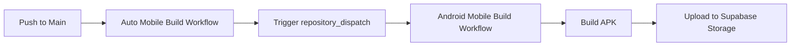

# Automated Mobile Build Setup

This guide explains how to set up automated mobile app builds that trigger when code is pushed to the main branch.

## Overview

The automated build system consists of:

1. **Auto-trigger workflow** (`.github/workflows/auto-mobile-build.yml`) - Triggers on push to main
2. **Build workflow** (`.github/workflows/screens-android-mobile-build.yml`) - Performs the actual build
3. **Edge function** (`supabase/functions/trigger-app-build`) - Manages build records

## How It Works



## Required Secrets

For the automated builds to work, you need to configure these GitHub secrets:

### Supabase Secrets
- `VITE_SUPABASE_URL` - Your Supabase project URL
- `VITE_SUPABASE_ANON_KEY` - Supabase anonymous key
- `VITE_SUPABASE_PROJECT_ID` - Supabase project ID
- `SUPABASE_SERVICE_ROLE_KEY` - Service role key for admin operations
- `GH_ACTION_SECRET` - Secret for updating build status

### API Keys
- `VITE_MAPBOX_PUBLIC_TOKEN` - Mapbox public token
- `VITE_STRIPE_PUBLISHABLE_KEY` - Stripe publishable key
- `STRIPE_SECRET_KEY` - Stripe secret key
- `RESEND_API_KEY` - Resend API key
- `HUGGING_FACE_ACCESS_TOKEN` - Hugging Face token

### GitHub Secrets
- `GITHUB_ACCESS_TOKEN` - Personal access token with repo access
- `GITHUB_REPO_OWNER` - Your GitHub username/org
- `GITHUB_REPO_NAME` - Repository name
- `GITHUB_TOKEN` - Automatically provided by GitHub Actions

### Android Signing (Optional but Recommended)
- `ANDROID_SIGNING_KEY_BASE64` - Base64 encoded keystore file
- `ANDROID_SIGNING_KEY_ALIAS` - Keystore alias
- `ANDROID_SIGNING_KEY_PASSWORD` - Key password
- `ANDROID_SIGNING_STORE_PASSWORD` - Keystore password

## Setting Up GitHub Secrets

1. Go to your GitHub repository
2. Click **Settings** → **Secrets and variables** → **Actions**
3. Click **New repository secret**
4. Add each secret from the list above

## Trigger Conditions

Builds are automatically triggered when you push to `main` branch and changes are detected in:

- `src/**` - Source code files
- `public/**` - Public assets
- `capacitor.config.js` - Capacitor configuration
- `vite.config.ts` - Build configuration
- `package.json` - Dependencies
- `.github/workflows/screens-android-mobile-build.yml` - Build workflow changes

## Manual Triggers

You can also trigger builds manually:

### Via GitHub UI
1. Go to **Actions** tab
2. Select **Auto Mobile Builds on Main** workflow
3. Click **Run workflow**

### Via API
```bash
curl -X POST \
  "https://api.github.com/repos/YOUR_ORG/YOUR_REPO/dispatches" \
  -H "Authorization: Bearer YOUR_GITHUB_TOKEN" \
  -H "Accept: application/vnd.github+json" \
  -d '{"event_type":"trigger-screens-android-mobile-build","client_payload":{"build_id":"manual","version":"1.0.0"}}'
```

### Via Supabase Edge Function (Admin Only)
```javascript
const response = await fetch(`${SUPABASE_URL}/functions/v1/trigger-app-build`, {
  method: 'POST',
  headers: {
    'Authorization': `Bearer ${USER_TOKEN}`,
    'Content-Type': 'application/json'
  },
  body: JSON.stringify({
    app_type: 'screens_android_mobile'
  })
});
```

## Monitoring Builds

### GitHub Actions
- Go to **Actions** tab in your repository
- Click on the running workflow to see progress
- View logs for detailed build information

### Supabase Dashboard
Builds are tracked in the `app_builds` table:
```sql
SELECT * FROM app_builds 
ORDER BY created_at DESC 
LIMIT 10;
```

## Build Artifacts

Successful builds are stored in two locations:

1. **GitHub Artifacts** - Available in the workflow run for 90 days
2. **Supabase Storage** - Permanently stored in the `apk-files` bucket

## Troubleshooting

### Build Not Triggering
- Check that you pushed to the `main` branch
- Verify changes were made in monitored paths
- Check GitHub Actions is enabled for your repository

### Build Failing
- Review build logs in GitHub Actions
- Verify all required secrets are configured
- Check that Capacitor platform is properly set up

### APK Upload Failing
- Verify `SUPABASE_SERVICE_ROLE_KEY` is correct
- Check Supabase Storage bucket `apk-files` exists
- Ensure bucket has appropriate permissions

## Customization

### Add iOS Builds
Edit `.github/workflows/auto-mobile-build.yml` to add iOS trigger:

```yaml
- name: Trigger iOS Build
  run: |
    curl -X POST \
      "https://api.github.com/repos/${{ github.repository }}/dispatches" \
      -H "Authorization: Bearer ${{ secrets.GITHUB_TOKEN }}" \
      -d '{"event_type":"trigger-screens-ios-build","client_payload":{"build_id":"auto","version":"1.0.0"}}'
```

### Change Trigger Paths
Modify the `paths` section in the workflow:

```yaml
on:
  push:
    branches:
      - main
    paths:
      - 'src/**'
      - 'your/custom/path/**'
```

### Add Notifications
Add a notification step after the build triggers:

```yaml
- name: Send Notification
  run: |
    curl -X POST YOUR_WEBHOOK_URL \
      -d '{"text":"Mobile build triggered for commit ${{ github.sha }}"}'
```

## Best Practices

1. **Test Locally First** - Always test builds locally before pushing to main
2. **Use Signed Builds** - Configure signing secrets for production releases
3. **Monitor Build Status** - Set up notifications for build failures
4. **Version Control** - Use semantic versioning for releases
5. **Clean Up Old Builds** - Regularly archive old APKs from storage

## Support

For issues with automated builds:
1. Check the [troubleshooting guide](../docs/PHASE1_CHECKLIST.md)
2. Review GitHub Actions logs
3. Check Supabase edge function logs
4. Verify all secrets are correctly configured
