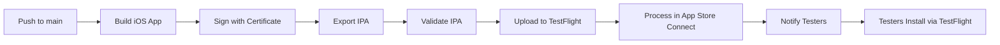

# TestFlight Automatic Deployment Setup

This guide explains how to set up automatic TestFlight deployment for RedSquare iOS builds. Once configured, successful iOS builds will automatically upload to TestFlight for beta testing.

## Overview

When you push code or trigger a build, the workflow will:
1. Build and sign your iOS app
2. Validate the IPA for App Store submission
3. Upload to TestFlight automatically
4. Process the build in App Store Connect
5. Make it available for beta testing

## Prerequisites

- ✅ Apple Developer Program membership ($99/year)
- ✅ App created in App Store Connect
- ✅ iOS code signing configured (see [iOS Code Signing Setup](./IOS_CODE_SIGNING_SETUP.md))
- ✅ TestFlight agreement accepted in App Store Connect

## Step 1: Create App in App Store Connect

If you haven't already:

1. Go to [App Store Connect](https://appstoreconnect.apple.com)
2. Click **Apps** → **+** (Add button)
3. Fill in:
   - **Platform**: iOS
   - **Name**: RedSquare
   - **Primary Language**: English (US)
   - **Bundle ID**: Select your bundle ID (e.g., `com.redsquare.screens`)
   - **SKU**: Any unique identifier (e.g., `redsquare-001`)
4. Click **Create**
5. Complete required information (Privacy Policy, etc.)

## Step 2: Generate App Store Connect API Key

App Store Connect API keys allow secure, automated uploads to TestFlight without passwords.

### Create API Key

1. Go to [App Store Connect](https://appstoreconnect.apple.com)
2. Click **Users and Access** (in the sidebar)
3. Click **Integrations** tab
4. Click **App Store Connect API** → **Keys** tab
5. Click **Generate API Key** (+)
6. Fill in:
   - **Name**: `GitHub Actions TestFlight`
   - **Access**: **App Manager** (required for TestFlight uploads)
7. Click **Generate**

### Download and Save Key Information

After generating:

1. **Download the API Key (.p8 file)**
   - ⚠️ You can only download this ONCE - save it securely!
   - File name format: `AuthKey_XXXXXXXXXX.p8`

2. **Copy the Key ID**
   - 10-character alphanumeric (e.g., `AB12CD34EF`)
   - This is shown next to the key name

3. **Copy the Issuer ID**
   - UUID format (e.g., `12345678-1234-1234-1234-123456789012`)
   - Found at the top of the Keys page

**CRITICAL**: Store these securely - the .p8 file cannot be re-downloaded!

## Step 3: Convert API Key to Base64

GitHub secrets require the API key in Base64 format.

### On macOS/Linux:

```bash
base64 -i AuthKey_XXXXXXXXXX.p8 -o api-key-base64.txt
```

### On Windows (PowerShell):

```powershell
[Convert]::ToBase64String([IO.File]::ReadAllBytes("AuthKey_XXXXXXXXXX.p8")) | Out-File api-key-base64.txt
```

## Step 4: Add Secrets to GitHub

Go to your GitHub repository → **Settings** → **Secrets and variables** → **Actions**

Add these 3 secrets:

### Required Secrets:

1. **APP_STORE_CONNECT_API_KEY_BASE64**
   - Value: Contents of `api-key-base64.txt`
   - This is your Base64-encoded .p8 key file

2. **APP_STORE_CONNECT_API_KEY_ID**
   - Value: Your 10-character Key ID (e.g., `AB12CD34EF`)
   - Found in App Store Connect → Users and Access → Keys

3. **APP_STORE_CONNECT_API_ISSUER_ID**
   - Value: Your Issuer ID (UUID format)
   - Found at the top of the Keys page in App Store Connect

### Security Notes:

- Never commit the .p8 key file to Git
- Backup the .p8 file securely (encrypted storage, password manager)
- Rotate keys if compromised
- Use minimum required permissions (App Manager for TestFlight)

## Step 5: Verify Workflow Configuration

The workflow at `.github/workflows/screens-ios-build.yml` should already be configured to use TestFlight deployment.

Key sections:

```yaml
- name: Setup App Store Connect API Key
  if: env.APP_STORE_CONNECT_API_KEY_BASE64 != ''
  run: |
    echo "$APP_STORE_CONNECT_API_KEY_BASE64" | base64 --decode > ~/private_keys/AuthKey_${{ secrets.APP_STORE_CONNECT_API_KEY_ID }}.p8

- name: Upload to TestFlight
  if: env.APP_STORE_CONNECT_API_KEY_BASE64 != ''
  run: |
    xcrun altool --upload-app \
      --type ios \
      --file "$IPA_PATH" \
      --apiKey "$APP_STORE_CONNECT_API_KEY_ID" \
      --apiIssuer "$APP_STORE_CONNECT_API_ISSUER_ID"
```

## Step 6: Test TestFlight Deployment

### Trigger a Build

1. Make sure iOS code signing is configured (required)
2. Go to **Actions** tab in GitHub
3. Select "Build RedSquare Screens (iOS)"
4. Click **Run workflow**
5. Enter version (e.g., `1.0.0`)
6. Click **Run workflow**

### Monitor the Build

1. Watch the workflow progress
2. Build steps:
   - ✅ Build iOS app (5-10 min)
   - ✅ Export IPA with code signing
   - ✅ Validate for App Store
   - ✅ Upload to TestFlight (2-5 min)

### Check App Store Connect

1. Go to [App Store Connect](https://appstoreconnect.apple.com)
2. Select your app → **TestFlight** tab
3. Wait 5-10 minutes for processing
4. Your build will appear under **iOS Builds**

## Step 7: Distribute to Testers

Once the build appears in TestFlight:

### Add Internal Testers

1. In App Store Connect → **TestFlight** → **Internal Testing**
2. Click **+** to add testers
3. Enter email addresses of team members
4. They'll receive TestFlight invitation emails
5. Testers install TestFlight app and accept invitation

### Create External Testing Group (Optional)

1. Click **External Testing** → **+** (Create Group)
2. Name: `Beta Testers`
3. Add builds to the group
4. Add external testers (requires App Store review for first build)
5. Enable **Automatic Distribution** for future builds

### Testing Best Practices

- Start with internal testing before external
- Add test information and what to test
- Set up automatic distribution for seamless updates
- Monitor crash reports and feedback in TestFlight

## Automatic vs Manual Upload

### When TestFlight Upload Happens

TestFlight upload is **automatic** when:
- ✅ iOS code signing secrets are configured
- ✅ App Store Connect API secrets are configured
- ✅ Build completes successfully

TestFlight upload is **skipped** when:
- ❌ No App Store Connect API secrets configured
- ❌ No code signing configured (development build)
- ❌ Build fails

### Manual Upload Alternative

If you prefer manual control, you can:

1. Download the IPA from GitHub Actions artifacts
2. Upload manually via:
   - **Transporter app** (Mac App Store)
   - **Xcode Organizer** (Window → Organizer → Archives)
   - **altool command line**: `xcrun altool --upload-app --file App.ipa --apiKey KEY_ID --apiIssuer ISSUER_ID`

## Version Management

### Update Version for Each Build

Edit `ios/App/App/Info.plist`:

```xml
<key>CFBundleShortVersionString</key>
<string>1.0.0</string>
<key>CFBundleVersion</key>
<string>1</string>
```

Or use `agvtool` to increment automatically:

```bash
cd ios/App
agvtool next-version -all  # Increment build number
agvtool new-marketing-version 1.0.1  # Set version string
```

**IMPORTANT**: TestFlight requires unique build numbers. Increment `CFBundleVersion` for each upload.

## Troubleshooting

### Upload fails with "Authentication failed"

- Verify `APP_STORE_CONNECT_API_KEY_ID` matches exactly (10 characters)
- Check `APP_STORE_CONNECT_API_ISSUER_ID` is correct UUID
- Ensure .p8 key file was decoded correctly from Base64
- Verify API key has **App Manager** access in App Store Connect

### Upload fails with "Invalid IPA"

- Ensure iOS code signing is properly configured
- Verify provisioning profile matches Bundle ID
- Check that IPA was built with `app-store` export method
- Validate IPA locally: `xcrun altool --validate-app --file App.ipa --apiKey KEY_ID --apiIssuer ISSUER_ID`

### Build doesn't appear in TestFlight

- Wait 5-10 minutes for Apple's processing
- Check for email from Apple about processing issues
- Verify app status in App Store Connect
- Look for compliance/export requirements that need to be addressed

### "Missing compliance" error

After upload, you may need to:
1. Go to TestFlight → Build → **Provide Export Compliance Information**
2. Answer questions about encryption usage
3. Submit compliance information

### API Key permissions error

- Verify key has **App Manager** access (not just Developer or Marketing)
- Keys with insufficient permissions cannot upload to TestFlight
- Create a new key if needed and update secrets

## Security Best Practices

- [ ] API key stored in GitHub secrets only (never in code)
- [ ] .p8 file backed up securely and separately
- [ ] Only required team members have App Store Connect access
- [ ] API key has minimum required permissions (App Manager)
- [ ] Key rotation plan in place (rotate annually)
- [ ] Monitor App Store Connect activity for unauthorized uploads

## TestFlight Limitations

### Tester Limits
- **Internal testers**: 100 max (Apple Developer team members)
- **External testers**: 10,000 max (requires App Review for first build)

### Build Limits
- Maximum of 100 active builds at a time
- Builds expire after 90 days
- No limit on number of uploads

### App Review (External Testing Only)
- First external build requires App Review (~24-48 hours)
- Subsequent builds to same group don't require review
- Major feature changes may require re-review

## Next Steps After Setup

1. ✅ Configure TestFlight secrets
2. ✅ Trigger a test build
3. ✅ Verify upload to TestFlight
4. ✅ Add internal testers
5. ✅ Distribute first test build
6. ✅ Set up crash reporting
7. 🚀 Enable automatic distribution for seamless updates

## Automated Distribution Flow

With everything configured:



## Additional Resources

- [App Store Connect API Documentation](https://developer.apple.com/documentation/appstoreconnectapi)
- [TestFlight Documentation](https://developer.apple.com/testflight/)
- [Using altool for uploads](https://help.apple.com/itc/apploader/#/apdATD1E53-D1E1A1303-D1E53A1126)
- [iOS Code Signing Guide](./IOS_CODE_SIGNING_SETUP.md)
- [Automated Builds Setup](./AUTO_BUILD_SETUP.md)

---

**Need help?** Check the [troubleshooting section](#troubleshooting) or review build logs in GitHub Actions.
